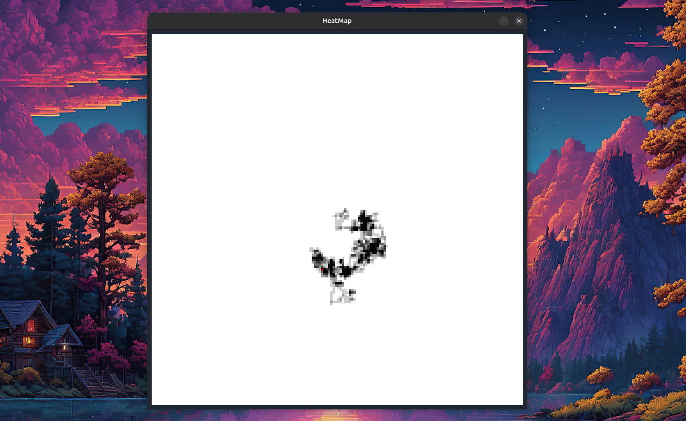

# Random Heat Map
This is a small simple program written in Java to create a randomly generated heat map.


You can run this program by either compiling it from source or download the pre-packaged JAR file.
**To run this program, <ins>you will need Java 8 or above</ins>**.

### Running the JAR File
Make sure you have Java version equal to or above Java 8.

Download the pre-packaged JAR from [releases](https://github.com/Karami4/random-heatmap/releases), and
use the following command in whatever terminal you prefer to run it. \<file> is the address of your file from the
current working directory of the terminal.

```shell
java -jar <file>
```

#### Verifying Authenticity of the File
The authenticity of the JAR file can be verified with the certificate below, or with the checksum provided
along with the file in [releases](https://github.com/Karami4/random-heatmap/releases).
```
-----BEGIN CERTIFICATE-----
MIIBOjCB4qADAgECAgkA3u1hwitVMyUwCgYIKoZIzj0EAwIwEjEQMA4GA1UEAxMH
S2FyYW1pNDAeFw0yNTA1MjIwMTA2MTNaFw0yNjA1MjIwMTA2MTNaMBIxEDAOBgNV
BAMTB0thcmFtaTQwWTATBgcqhkjOPQIBBggqhkjOPQMBBwNCAAR9WqDtqHJASZdv
EmrVojY5igrwCbxY/aPQF+lB9znvYkQLVCeSqDbSMkbut9of7betBZDQQadZrDuK
SEK5DCMEoyEwHzAdBgNVHQ4EFgQUSLfEnt6Ea+KvEQtcdGt6umm8NkIwCgYIKoZI
zj0EAwIDRwAwRAIgF5gIg2BEvq66YfpPcPT6zBdER0OZUU5t+Lf8/ZkHXIICICeU
FbeoE580ZKyQjUn6p4U+qrlj6Lv+PfDyIQFkazax
-----END CERTIFICATE-----
```

### Compiling from source
**You will need to have Maven installed**, if you do not have
Maven installed, it can be installed using a Package manager or from [this link](https://maven.apache.org/download.cgi). 
Clone the project from the GitHub repository and then build it using Maven.

```shell
git clone https://github.com/Karami4/random-heatmap.git
cd random-heatmap
chmod +x build.sh
./build.sh
```